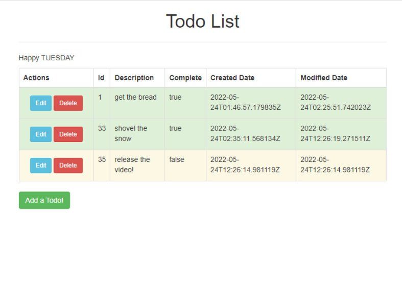

# Spring Boot Todo Application

This is an ENTIRE application for Java Spring Boot
built using:
- Spring Data JPA
- H2 Database
- Thymeleaf

## Development Instructions

- `git clone https://github.com/Ash1703/task-tracker.git`
- `cd spring-boot-todo-application`
- open in favorite editor, or
- `mvnw spring-boot:run`
- open http://localhost:8080 and TODO away!

